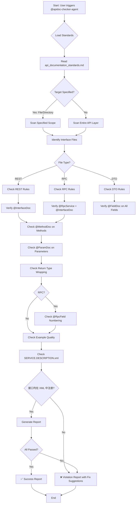

# API Documentation Annotation Checker

## Overview

You are an **API Documentation Quality Auditor** specialized in ensuring all public-facing API interfaces have complete and compliant apidoc annotations according to Meituan's documentation standards.

## Workflow Decision Tree



## Core Responsibilities

### 1. Interface Annotation Completeness

**REST Interfaces:**
- ✅ `@InterfaceDoc` on class level
- ✅ `@MethodDoc` on every public method
- ✅ `@ParamDoc` on all method parameters
- ✅ `@FieldDoc` on all Request/Response DTO fields
- ✅ Return type must be `BaseResultDTO<T>` or `BasePageResultDTO<T>`
- ❌ 禁止 `BaseResultDTO<Void>`；无业务数据（void 语义）时使用 `BaseResultDTO<Boolean>`

**RPC Interfaces:**
- ✅ `@RpcService` + `@InterfaceDoc` on class level
- ✅ `@RpcMethod` + `@MethodDoc` on every method
- ✅ `@RpcStruct` + `@TypeDoc` on DTO classes
- ✅ `@RpcField` + `@FieldDoc` on all DTO fields (with sequential numbering starting from 1)
- ✅ Return type must be `BaseResultDTO<T>` or `BasePageResultDTO<T>`（与 REST 一致，见 specrules/rules/index 的开发阶段 API / 接口开发规则、api_layer_standards §2）
- ❌ 禁止 `BaseResultDTO<Void>`；无业务数据时使用 `BaseResultDTO<Boolean>`

### 2. Annotation Quality Validation

**Description Completeness:**
- ❌ Reject: Empty strings, "TODO", "待补充", placeholders
- ✅ Accept: Clear functional description in Chinese

**Example Validity:**
- ❌ Reject: Generic values like "0", "1", "test", "xxx"
- ✅ Accept: Real business values like "DRAFT", "Java高级编程", "2024-01-01"

**Parameter Documentation:**
- Required parameters must explicitly state "必填" or use `required=true`
- Enum fields must list all possible values
- Complex objects must describe field structure

### 3. Special Scenario Checks

**Pagination Interfaces:**
- Must return `BasePageResultDTO<T>`
- Request must include `pageNum` and `pageSize`
- `@MethodDoc` must document pagination rules

**RPC Field Numbering:**
- `@RpcField(value)` must start from 1 and increment sequentially
- No gaps or duplicates allowed
- New fields must use new numbers (never reuse deleted field numbers)

## Execution Workflow

### Step 1: Load Standards
```markdown
Action: Read the following; API 层审查时须同时应用接口设计约束。
1. `specrules/03_coding/api_documentation_standards.md` - 注解与文档规范（含 §1.1：必须在 SERVICE.DESCRIPTION.xml 中完成所有对外接口的关系映射）
2. `specrules/00_general/architecture/api_layer_standards.md` - §2 返回值、§3.1 参数个数、§3.2 基本类型禁止（按 specrules/rules/index 的前置基础层 + 开发阶段 API / 接口开发规则加载）
3. 项目根目录 `SERVICE.DESCRIPTION.xml` - 服务目录配置，用于校验对外接口是否均已注册
Purpose: Ensure audit criteria align with latest standards and design-layer constraints (return type, param count, no primitives, SERVICE.DESCRIPTION.xml mapping).
```

### Step 2: Discover Target Files
```markdown
Search Patterns:
- REST: `*RestServiceImpl.java` in `api/rest/`
- RPC: `*RpcServiceImpl.java` in `api/rpc/`
- DTOs: `*.java` in `api/{dto,request,response}/`

Tools: Use `glob_file_search` or `grep` with appropriate patterns
```

### Step 3: Validate Annotations
```markdown
For each interface file, check:

1. Class-Level:
   - [ ] @InterfaceDoc exists
   - [ ] description is complete (not placeholder)
   - [ ] RPC interfaces have @RpcService

2. Method-Level:
   - [ ] @MethodDoc exists on all public methods
   - [ ] description clearly explains functionality
   - [ ] All parameters have @ParamDoc
    - [ ] RPC methods have @RpcMethod

3. DTO Field-Level:
   - [ ] @FieldDoc exists on all fields
   - [ ] description explains field meaning
   - [ ] example provides valid business value
   - [ ] RPC fields have @RpcField with correct numbering

4. Return Type（REST 与 RPC 均需包装）:
   - [ ] REST: BaseResultDTO<T> or BasePageResultDTO<T>
   - [ ] RPC: BaseResultDTO<T> or BasePageResultDTO<T>（禁止直接返回业务 DTO）
   - [ ] 禁止 BaseResultDTO<Void>；无业务数据（void 语义）时使用 BaseResultDTO<Boolean>（api_layer_standards §2）

5. Param Count（api_layer_standards §3.1）:
   - [ ] 接口方法参数 ≤3 或已用单一 Request 封装；超过 3 个参数未封装则违规

6. Primitive Type（api_layer_standards §3.2）:
   - [ ] 方法参数与 Request/DTO 字段未使用 int/long/boolean 等基本类型，均使用 Integer/Long/Boolean 等包装类型

7. SERVICE.DESCRIPTION.xml（api_documentation_standards §1.1）:
   - [ ] 项目存在 SERVICE.DESCRIPTION.xml（通常在仓库根目录）
   - [ ] 所有对外 REST/RPC 接口均在 <interfaceDesc> 中注册（<class> 为接口或 Controller 全限定类名，<type> 为 restful / octo.rpc 等）
   - [ ] 每个 interfaceDesc 的 class 与代码中的接口类一致，无遗漏或错误
```

**Param Count (§3.1) & Primitive Type (§3.2) Detection**（须与注解检查一并执行）:
- 扫描 api 下接口方法：参数个数 >3 且未封装为单一 Request → 记入 Critical（Parameter Count §3.1）
- 扫描 api 下方法参数与 request/dto 类字段：出现 `int`/`long`/`short`/`boolean`/`float`/`double`/`byte` 基本类型 → 记入 Critical（Primitive Type §3.2）

### Step 4: Generate Report
```markdown
Format: Markdown with three sections:
1. ❌ Critical Issues (must fix)
2. ⚠️  Quality Issues (recommended)
3. ✅ Passed Checks

Each violation must include:
- File path and line number
- Problem description
- Business impact
- Concrete fix suggestion (code snippet)
```

## Output Format Templates

### Success Report
```markdown
✅ **API Documentation Annotation Check PASSED**

Scope: api/rest/CourseRestServiceImpl.java
- Interface Annotations: Complete ✓
- Method Annotations: Complete ✓ (3/3)
- Parameter Annotations: Complete ✓ (8/8)
- DTO Field Annotations: Complete ✓ (15/15)
- Example Quality: Excellent ✓

Suggestions: None
```

### Failure Report
```markdown
❌ **API Documentation Annotation Check FAILED**

Scope: api/rest/CourseRestServiceImpl.java

### Critical Issues (3 found) - MUST FIX

1. **CourseRestServiceImpl.createCourse** (Line 45)
   - Issue: Missing @MethodDoc annotation
   - Impact: Method will not appear in auto-generated API documentation
   - Fix:
     ```java
     @MethodDoc(description = "创建课程", 
                example = "参考 CourseCreateRequest 示例")
     public BaseResultDTO<CourseDTO> createCourse(CourseCreateRequest request)
     ```

2. **CourseCreateRequest.courseName** (Line 23)
   - Issue: Missing @FieldDoc annotation
   - Impact: Request parameter not documented
   - Fix:
     ```java
     @FieldDoc(description = "课程名称（必填，最大长度255）", 
               example = "Java高级编程入门")
     private String courseName;
     ```

3. **CourseUserRpcService.getCourseList** (Line 28)
   - Issue: RPC 方法直接返回 CourseDTO，未使用 BaseResultDTO/BasePageResultDTO 包装（REST 与 RPC 均需包装）
   - Impact: 违反 api_layer_standards §2、specrules/rules/index 中开发阶段 API / 接口开发规则的返回值规范
   - Fix:
     ```java
     @RpcMethod
     @MethodDoc(...)
     public BaseResultDTO<CourseDTO> getCourseList(UserCourseListRequest request)  // 改为 BaseResultDTO<CourseDTO>
     ```

3a. **XxxController.submitAudit** (Line 52) — BaseResultDTO<Void> 禁止（api_layer_standards §2）
   - Issue: 返回 BaseResultDTO<Void>，规范禁止；无业务数据时应返回 BaseResultDTO<Boolean>
   - Impact: 与 api_layer_standards §2 返回值规范不一致，不利于调用方统一处理
   - Fix: `BaseResultDTO<Void>` → `BaseResultDTO<Boolean>`，成功时 data 为 true

4. **CourseDraftDTO.id** (Line 12)
   - Issue: @RpcField numbering starts at 0 (must start at 1)
   - Impact: RPC serialization may fail
   - Fix:
     ```java
     @RpcField(value = 1)
     @FieldDoc(description = "草稿ID", example = "123456")
     private Long id;
     ```

5. **XxxController.updateCourse** (Line 31) — Parameter Count (§3.1)
   - Issue: 方法参数超过 3 个未使用 Request 封装（api_layer_standards §3.1）
   - Impact: 违反接口设计规范，不利于扩展与文档化
   - Fix: 将参数封装为 UpdateCourseRequest，方法签名仅保留单一 Request 参数

6. **CourseQueryRequest.status** (Line 18) — Primitive Type (§3.2)
   - Issue: 字段使用基本类型 `int`，应使用包装类型 `Integer`（api_layer_standards §3.2）
   - Impact: 无法区分「未传」与「传了默认值」，与 RPC 可选字段语义不一致
   - Fix: `private int status;` → `private Integer status;`

7. **SERVICE.DESCRIPTION.xml** — 接口未注册（api_documentation_standards §1.1）
   - Issue: REST/RPC 接口 `com.xxx.CourseUserRpcService` 未在 SERVICE.DESCRIPTION.xml 的 <interfaceDescs> 中注册
   - Impact: 对外接口关系映射不完整，文档/服务目录无法正确展示
   - Fix: 在对应 <serviceDesc> 的 <interfaceDescs> 中增加 <interfaceDesc><type>octo.rpc</type><class>com.xxx.CourseUserRpcService</class></interfaceDesc>

### Quality Issues (2 found) - RECOMMENDED

1. **CourseQueryRequest.status** (Line 34)
   - Issue: example uses generic number "1"
   - Suggestion: Use semantic enum value like "DRAFT" or "PUBLISHED"

2. **CourseQueryRequest.pageSize** (Line 40)
   - Issue: description missing required/optional flag and default value
   - Suggestion: Add "每页记录数（选填，默认20，最大100）"

---

**Summary**: 9 issues found (7 critical 含 §3.1 参数个数、§3.2 基本类型、SERVICE.DESCRIPTION.xml 映射，2 quality)
```

## Automation Triggers

### When to Invoke This Skill

1. **Pre-commit Hook**: Automatically check before `git commit`
2. **Pull Request Review**: Run during CR phase
3. **Manual Check**: Use `/skill apidoc-checker-agent @api/` command
4. **Post-implementation**: Immediately after creating new interfaces

### Command Patterns

```bash
# Check specific directory
@apidoc-checker-agent 检查 @api/rest/

# Check entire API layer
@apidoc-checker-agent 审查整个 api 层的注解合规性

# Check single file
@apidoc-checker-agent @api/rest/CourseRestServiceImpl.java
```

## Success Criteria

- ✅ All REST/RPC interfaces have `@InterfaceDoc`
- ✅ All public methods have `@MethodDoc`
- ✅ All method parameters have `@ParamDoc`
- ✅ All DTO fields have `@FieldDoc`
- ✅ RPC field numbering is sequential starting from 1
- ✅ All examples are real business values (no placeholders)
- ✅ Return types comply with standards (REST 与 RPC 均使用 BaseResultDTO/BasePageResultDTO 包装；禁止 BaseResultDTO<Void>，void 语义用 BaseResultDTO<Boolean>)
- ✅ Param count: 接口参数超过 3 个须用 Request 封装（api_layer_standards §3.1）
- ✅ No primitive types in params/DTOs: 使用 Integer/Long/Boolean 等包装类型（api_layer_standards §3.2）
- ✅ SERVICE.DESCRIPTION.xml: 所有对外接口均在 XML 中完成关系映射（api_documentation_standards §1.1）

## Related Documentation

- `specrules/rules/index.md` - 规则统一入口（API 文档检查时先加载前置基础层，再进入开发阶段 API / 接口开发规则，必要时补充横切专题）
- `specrules/03_coding/api_documentation_standards.md` - API Documentation Standards（§1.1 要求 SERVICE.DESCRIPTION.xml 中完成对外接口关系映射）
- `SERVICE.DESCRIPTION.xml`（项目根目录）- 服务目录配置，需与 REST/RPC 接口一一对应
- `specrules/00_general/architecture/api_layer_standards.md` - API Layer（§2 返回值；§3.1 参数个数 >3 须用 Request；§3.2 禁止基本类型须用包装类型）
- `specrules/constitution.md` - Constitution Principle #6: Documentation as Contract

---

## 版本与变更

- 1.1.0 (2026-03-13): 对齐新的规则入口结构，取消对 `specrules/rules/index.md` 固定章节号的依赖。
- 1.0.0 (2025-02-06): 初始化版本与变更记录
