# Mermaid 图表标准

## 背景

Mermaid 是一种基于文本的图表生成工具,广泛用于技术文档中绘制流程图、时序图、类图等。本规范定义了 AI Agent 在生成 Mermaid 图表时必须遵循的语法规则和最佳实践,确保生成的图表能够正常渲染且具有良好的可读性。

## 核心原则

1. **语法严格性**：严格遵循 Mermaid 官方语法规范,避免语法错误导致渲染失败
2. **可读性优先**：节点命名清晰,连线标注明确,避免图表过于复杂
3. **特殊字符处理**：正确处理特殊字符,使用引号包裹含特殊字符的文本
4. **中文支持**：确保中文文本正常显示,无乱码

---

## 一、通用语法规范

### 1.1 基本结构

所有 Mermaid 图表必须以图表类型声明开头,并使用正确的缩进:

```markdown
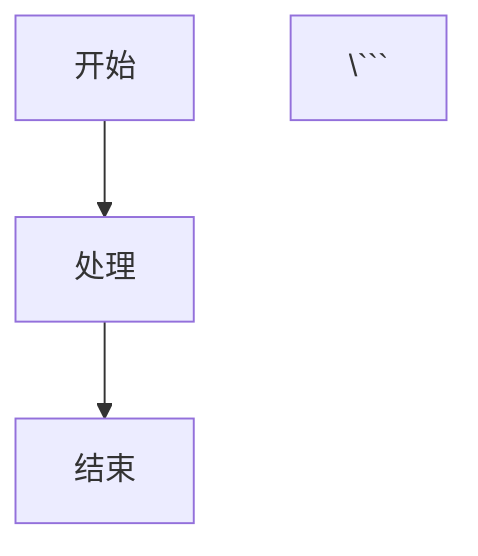

### 1.2 特殊字符处理规则

**必须使用引号包裹的场景**：

1. **包含以下特殊字符的文本必须用双引号或单引号包裹**：
   - 括号：`()`, `[]`, `{}`, `<>`, `【】`
   - 冒号：`:`
   - 分号：`;`
   - 逗号：`,`
   - 引号：`"`, `'`, `` ` ``
   - 连接符：`--`, `---`, `-->`, `-.->`, `==>`, `-.->`
   - 竖线：`|`
   - 斜线：`/`, `\`
   - 问号：`?`
   - 感叹号：`!`
   - 其他 Mermaid 关键字

**示例**：

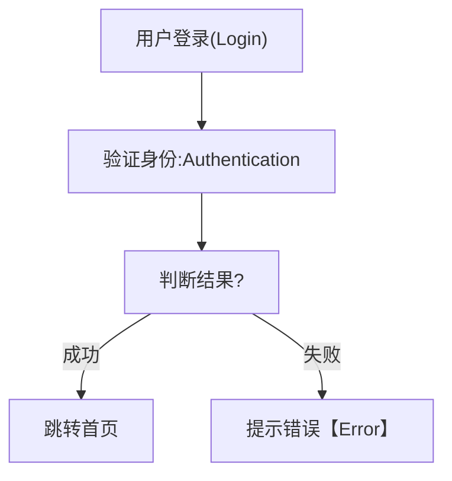

**错误示例（会导致渲染失败）**：

```mermaid
graph TD
    A[用户登录(Login)] --> B[验证身份:Authentication]  ❌ 未用引号包裹
    B --> C[判断结果?]  ❌ 未用引号包裹
```

### 1.3 中文文本规范

- ✅ 推荐：中文文本直接写入,无需转义
- ✅ 推荐：如果中文文本包含特殊字符,使用双引号包裹
- ❌ 禁止：不要使用 HTML 实体编码(如 `&#x4E2D;`)

**示例**：

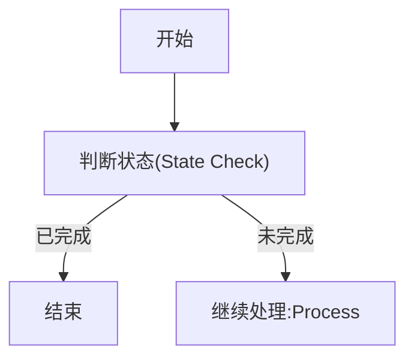

### 1.4 节点 ID 命名规范

- ✅ 推荐：使用简短的英文字母和数字作为节点 ID
- ✅ 推荐：使用驼峰命名法或下划线分隔(如 `nodeA`, `node_a`)
- ❌ 禁止：使用中文作为节点 ID
- ❌ 禁止：使用特殊字符作为节点 ID
- ❌ 禁止：使用 Mermaid 保留关键字作为节点 ID

**Mermaid 保留关键字（不可用作节点 ID）**：

`end`、`subgraph`、`direction`、`graph`、`flowchart`、`sequenceDiagram`、`classDiagram`、`stateDiagram`、`erDiagram`、`gantt`、`pie`、`gitGraph`、`click`、`style`、`linkStyle`、`classDef`、`class`、`default`

> ⚠️ 最常见的错误是使用 `end` 作为结束节点 ID，会导致解析器报 `Expecting 'SEMI', 'NEWLINE'... got 'end'` 错误。应改用 `end1`、`endNode`、`finish` 等替代名称。

**示例**：

```mermaid
graph TD
    start[开始] --> checkStatus["检查状态"]  ✅ ID 为 start, checkStatus
    checkStatus --> end1[结束]  ✅ ID 为 end1，而非 end
```

**错误示例**：

```mermaid
graph TD
    开始 --> 检查状态  ❌ 使用中文作为 ID
    node-1 --> node-2  ❌ ID 中包含连字符（可能与箭头符号混淆）
    start --> end[结束]  ❌ end 是保留关键字，会导致解析失败
```

---

## 二、流程图 (Flowchart) 规范

### 2.1 图表类型声明

支持的流程图类型：
- `graph TD`：从上到下 (Top Down)
- `graph LR`：从左到右 (Left to Right)
- `graph BT`：从下到上 (Bottom to Top)
- `graph RL`：从右到左 (Right to Left)

**推荐**：默认使用 `graph TD`,除非横向布局更清晰时使用 `graph LR`。

### 2.2 节点形状

| 节点类型 | 语法 | 适用场景 |
|---------|------|---------|
| 矩形 | `A[文本]` | 普通处理步骤 |
| 圆角矩形 | `A(文本)` | 开始/结束节点 |
| 圆形 | `A((文本))` | 连接点 |
| 菱形 | `A{文本}` | 判断节点 |
| 平行四边形 | `A[/文本/]` | 输入/输出 |
| 梯形 | `A[\文本\]` | 手动操作 |

**示例**：

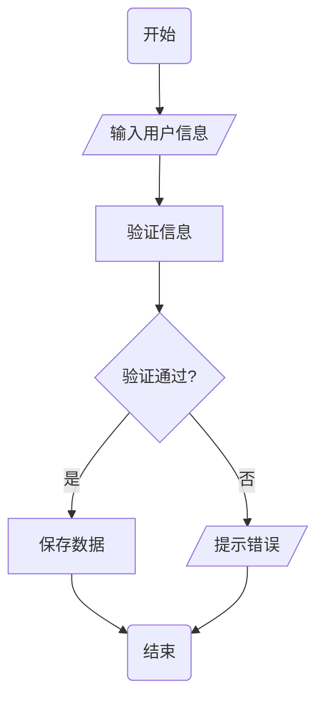

### 2.3 连接线类型

| 连接线类型 | 语法 | 适用场景 |
|-----------|------|---------|
| 实线箭头 | `A --> B` | 正常流程 |
| 虚线箭头 | `A -.-> B` | 异步/可选流程 |
| 粗箭头 | `A ==> B` | 强调的主流程 |
| 带文字的箭头 | `A -->|文本| B` | 条件分支 |
| 无箭头线 | `A --- B` | 关联关系 |

**注意**：箭头文本如果包含特殊字符,必须用引号包裹：

```mermaid
graph TD
    A --> B
    B -->|"成功(Success)"| C  ✅ 正确
    B -->|"失败:Failure"| D  ✅ 正确
```

### 2.4 子图 (Subgraph)

用于将相关节点分组:

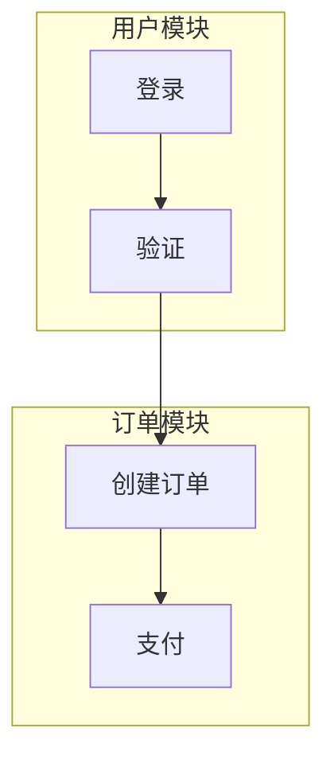

**注意**：子图标题如果包含特殊字符,必须用引号包裹。

---

## 三、时序图 (Sequence Diagram) 规范

### 3.1 基本语法

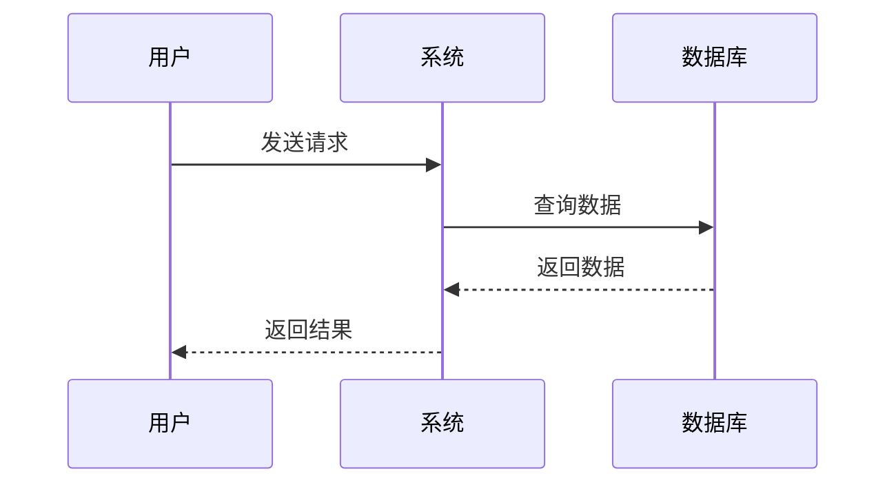

### 3.2 参与者 (Participant)

- ✅ 推荐：使用 `participant` 明确定义参与者,并使用 `as` 设置显示名称
- ✅ 推荐：参与者 ID 使用简短英文,显示名称使用中文

**示例**：

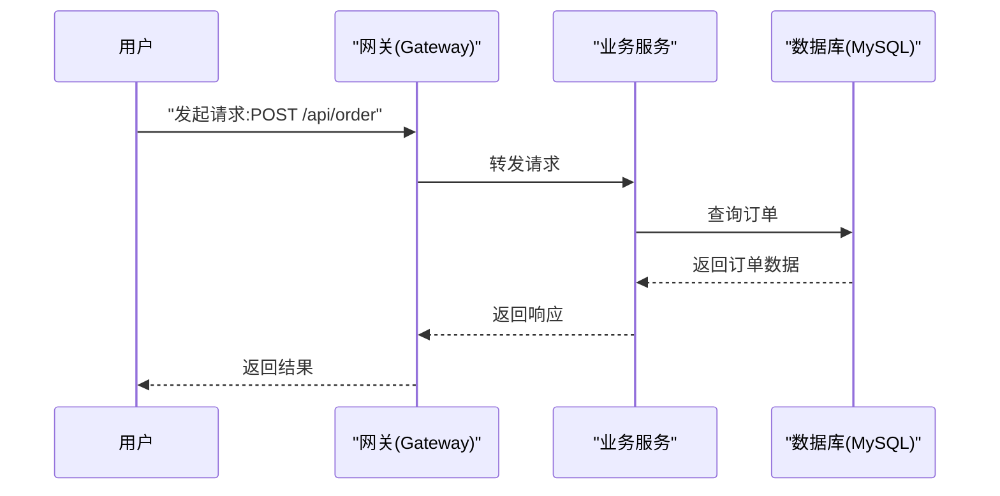

### 3.3 消息类型

| 消息类型 | 语法 | 适用场景 |
|---------|------|---------|
| 同步调用 | `A->>B: 消息` | 请求并等待响应 |
| 异步调用 | `A-)B: 消息` | 异步消息,不等待响应 |
| 返回消息 | `A-->>B: 消息` | 响应返回 |
| 激活框 | `activate A` / `deactivate A` | 表示对象处于活动状态 |

**示例**：

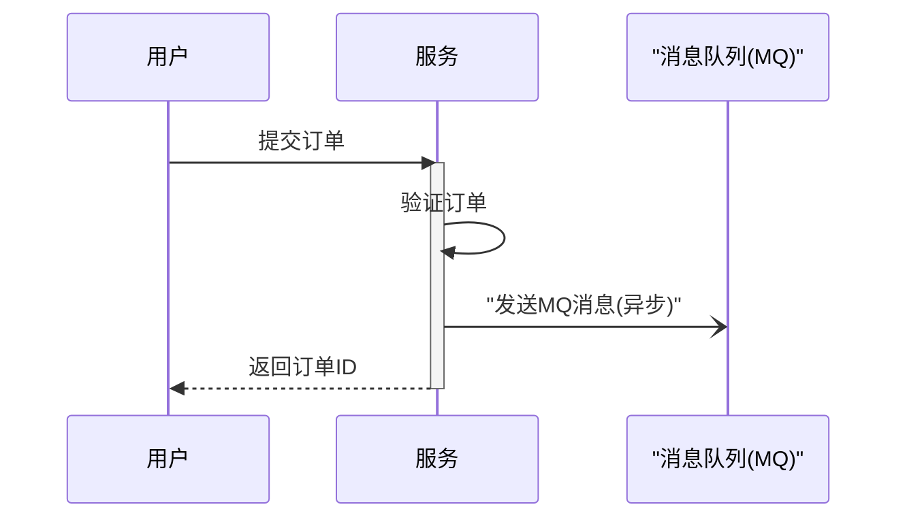

### 3.4 条件和循环

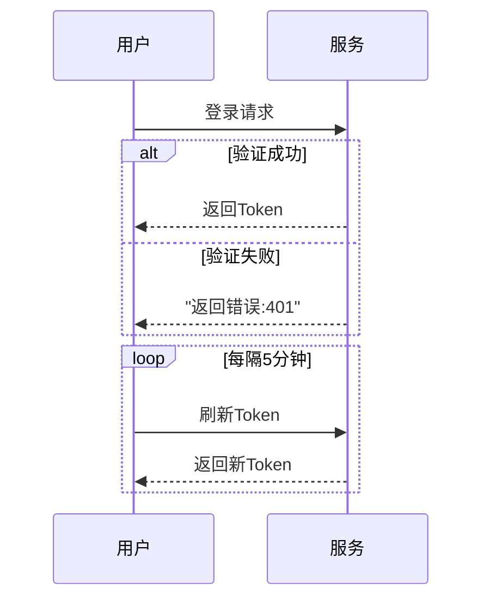

---

## 四、类图 (Class Diagram) 规范

### 4.1 基本语法

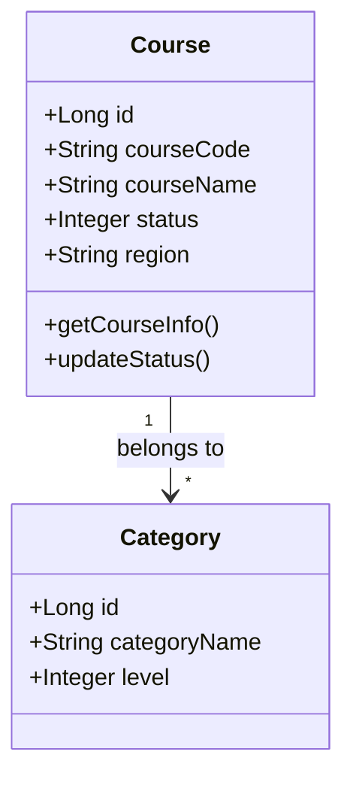

### 4.2 类成员定义

- `+` 表示 public
- `-` 表示 private
- `#` 表示 protected
- `~` 表示 package

### 4.3 关系类型

| 关系 | 语法 | 含义 |
|------|------|------|
| 继承 | `A <|-- B` | B 继承 A |
| 实现 | `A <|.. B` | B 实现 A |
| 组合 | `A *-- B` | A 包含 B(强关联) |
| 聚合 | `A o-- B` | A 包含 B(弱关联) |
| 关联 | `A --> B` | A 关联 B |
| 依赖 | `A ..> B` | A 依赖 B |

---

## 五、状态图 (State Diagram) 规范

### 5.1 状态 ID 约束（stateDiagram-v2 必读）

**迁移箭头两侧必须是未加引号的状态 ID**：在 `stateDiagram-v2` 中，`-->` 的左右两侧只能是**标识符（ID）**，不能使用引号包裹的字符串。解析器期望 `ID` 或 `EDGE_STATE`，使用 `"待发布(100)"` 等引号形式会报错：`Expecting 'ID', 'EDGE_STATE', got 'STRING'`。

- ✅ **正确**：迁移中写状态 id，如 `draft --> waiting : 发布`；id 由字母、数字、下划线等组成，或为不含括号/冒号的简短中文（视解析器而定）。
- ❌ **错误**：在迁移中使用引号状态名，如 `[*] --> "待发布(100)" : 新建`。

**需要显示「中文(编码)」且渲染出中文时**：用 `state "显示文案" as id`，**显示文案**会出现在状态框里，**id** 用于迁移中引用。迁移标签用**中文**（如「开始分发」），否则箭头上会显示英文。

- ✅ **推荐**：`state "待发布(100)" as d100`，迁移写 `[*] --> d100 : 新建任务组`，状态框与箭头均显示中文。
- ⚠️ **不推荐**：`state id : 待发布(100)` 后迁移写 id —— 部分渲染器只显示 id，状态框与箭头会变成英文。

**示例（状态带编码、全中文展示）**：

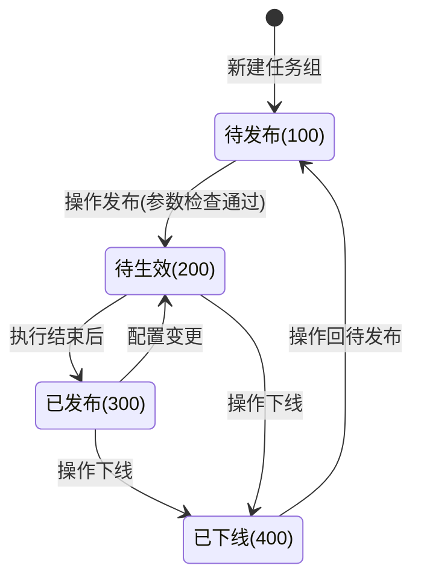

### 5.2 基本语法（简单状态名）

当状态名不含括号、冒号等特殊字符时，可直接在迁移中写状态名：

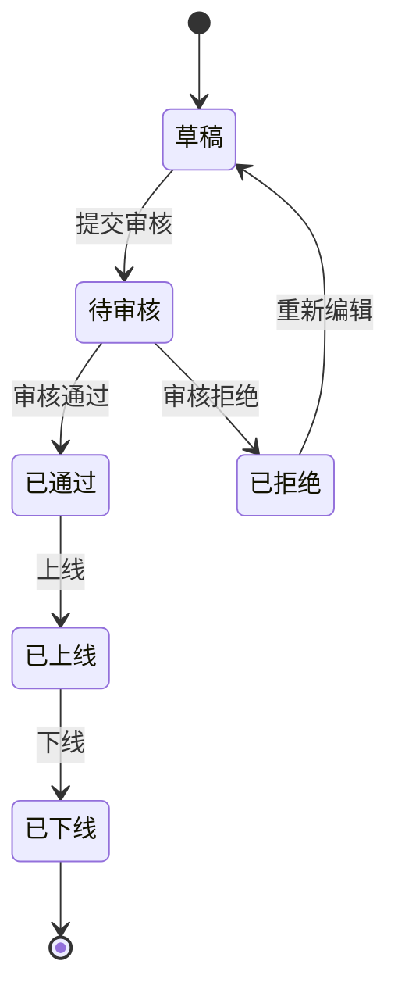

### 5.3 复合状态

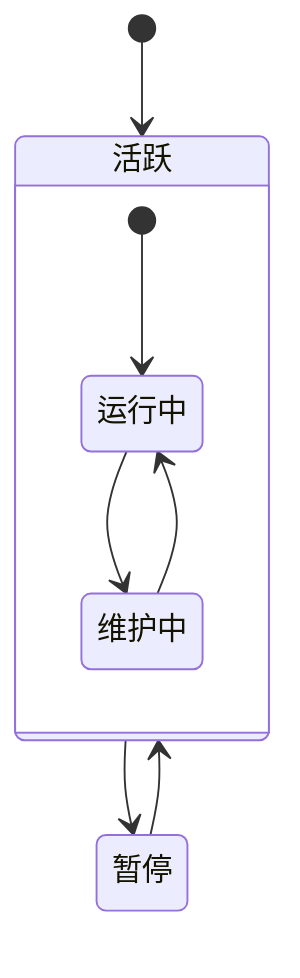

> **小结**：迁移两侧必须是**未加引号的 ID**。要状态框与箭头都显示中文时，用 `state "显示文案" as id`，迁移标签写中文；避免 `state id : 显示文案`，部分渲染器会只显示 id 与英文标签。

---

## 六、甘特图 (Gantt Chart) 规范

### 6.1 基本语法

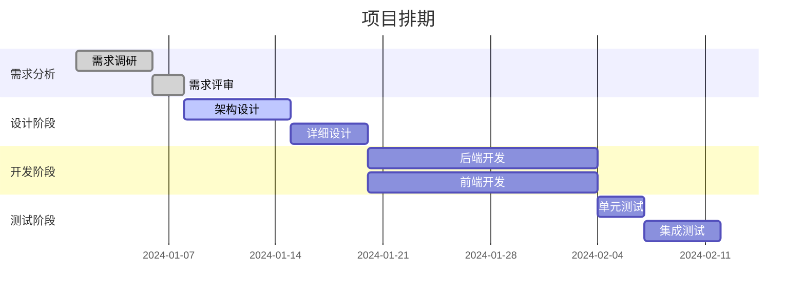

---

## 七、ER 图 (Entity Relationship Diagram) 规范

### 7.1 基本语法

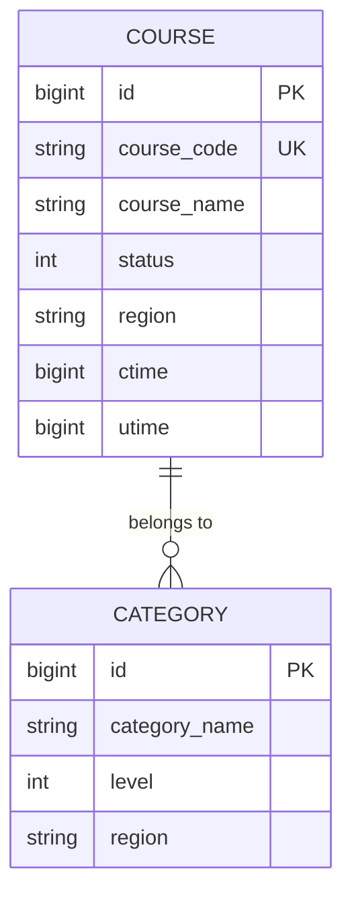

### 7.2 关系类型

| 符号 | 含义 |
|------|------|
| `||--o{` | 一对多 |
| `}o--o{` | 多对多 |
| `||--||` | 一对一 |
| `}o--||` | 多对一 |

---

## 八、常见错误和解决方案

### 错误 1：特殊字符未转义

**错误**：
```mermaid
graph TD
    A[用户登录(Login)] --> B  ❌ 括号未用引号包裹
```

**正确**：
```mermaid
graph TD
    A["用户登录(Login)"] --> B  ✅
```

### 错误 2：箭头文本包含特殊字符

**错误**：
```mermaid
graph TD
    A -->|成功:Success| B  ❌ 冒号未用引号包裹
```

**正确**：
```mermaid
graph TD
    A -->|"成功:Success"| B  ✅
```

### 错误 3：节点 ID 使用连字符

**错误**：
```mermaid
graph TD
    node-1 --> node-2  ❌ 可能与箭头符号混淆
```

**正确**：
```mermaid
graph TD
    node1 --> node2  ✅
    node_a --> node_b  ✅
```

### 错误 4：节点 ID 使用 Mermaid 保留关键字

**错误**：
```mermaid
graph TD
    start(开始) --> detail["查看文章详情"]
    detail --> end(结束)  ❌ end 是保留关键字，解析器报错
```

**正确**：
```mermaid
graph TD
    start(开始) --> detail["查看文章详情"]
    detail --> finish(结束)  ✅ 改用 finish / end1 / endNode 等
```

> 报错特征：`Expecting 'SEMI', 'NEWLINE', 'SPACE', 'EOF', 'subgraph'... got 'end'`，根因是节点 ID 与保留字冲突。

### 错误 5：子图标题包含特殊字符

**错误**：
```mermaid
graph TD
    subgraph 用户模块:User Module  ❌ 冒号未用引号包裹
        A --> B
    end
```

**正确**：
```mermaid
graph TD
    subgraph "用户模块:User Module"  ✅
        A --> B
    end
```

---

## 九、最佳实践

### 9.1 图表可读性

1. **避免单图过于复杂**：如果节点超过 15 个,考虑拆分为多个子图
2. **使用有意义的节点 ID**：如 `validateUser` 而不是 `node1`
3. **合理使用子图**：将相关节点分组到子图中
4. **添加注释**：在复杂图表中添加 `%% 注释说明`

### 9.2 图表命名规范

- 流程图：`业务流程图`、`异常处理流程图`
- 时序图：`系统交互时序图`、`XX功能时序图`
- 类图：`领域模型类图`、`数据模型类图`
- 状态图：`XX状态流转图`

### 9.3 图表层次结构

对于复杂系统,推荐使用分层图表：

1. **第一层：整体架构图**
   - 展示系统间的交互关系
   - 使用简单的框图

2. **第二层：模块交互图**
   - 展示模块内部的交互流程
   - 使用流程图或时序图

3. **第三层：详细流程图**
   - 展示具体功能的详细流程
   - 包含异常处理分支

---

## 十、检查清单

在生成 Mermaid 图表后,使用以下清单验证：

- [ ] **语法正确**：图表可正常渲染,无语法错误
- [ ] **特殊字符处理**：所有含特殊字符的文本都用引号包裹
- [ ] **节点 ID 规范**：使用简短英文 ID,避免使用连字符
- [ ] **中文支持**：中文文本正常显示,无乱码
- [ ] **图表类型正确**：根据场景选择合适的图表类型
- [ ] **节点命名清晰**：节点文本描述准确,无歧义
- [ ] **连线标注明确**：条件分支的连线文本清晰
- [ ] **图表可读性**：布局合理,避免过于复杂
- [ ] **图表完整性**：包含主要流程和关键决策点

---

---

## 参考资源

- [Mermaid 官方文档](https://mermaid.js.org/)
- [Mermaid Live Editor](https://mermaid.live/) - 在线编辑和预览工具

---

## 总结

本规范为 AI Agent 和开发者提供了全面的 Mermaid 图表绘制指导,涵盖了流程图、时序图、类图、状态图等常用图表类型,并特别强调了特殊字符处理规则。通过严格遵循本规范,可以确保生成的图表能够正常渲染且具有良好的可读性。
