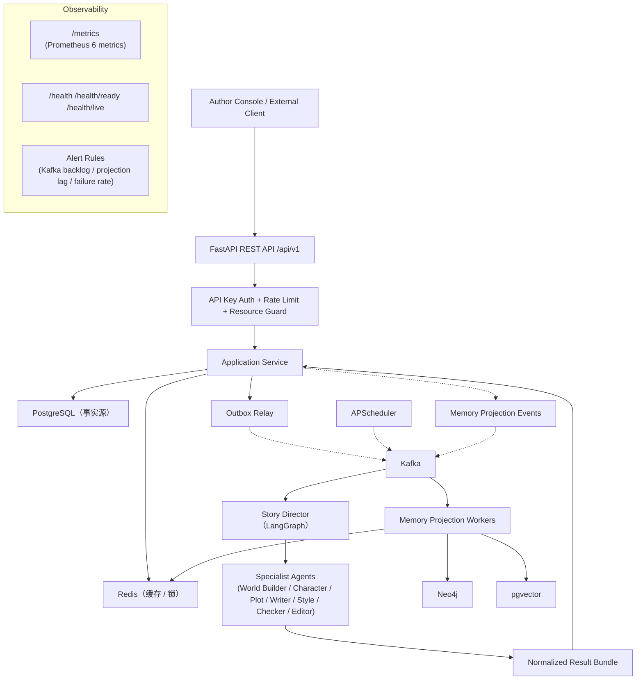

# StoryForge 系统架构总览

> **服务类型**: Web Service + Background Workers
> **职责**: 多 Agent 自动化长篇小说创作系统，将小说创作拆解为可编排、可恢复、可持续运行的多 Agent 流水线
> **技术栈**: Python 3.11 + FastAPI + LangGraph + Deepseek + PostgreSQL + pgvector + Neo4j + Redis + Kafka

---

## 模块列表

| 业务模块 | 职责概述 | 文档 |
|---------|---------|------|
| story-forge | StoryForge 多 Agent 自动化长篇小说创作系统（主模块） | [文档](story-forge/) |
| story-forge-infra | 基础设施层（数据库/缓存/消息队列/图数据库/向量存储连接管理） | [文档](story-forge/) |

## 核心功能

- 从 Story Seed 出发，经过世界观构建、人物生成、剧情规划完成初始化
- Chapter Pipeline 多 Agent 流水线：草稿 → 文风润色 → 一致性校验 → 编辑
- Story Memory Engine：PostgreSQL 事实源 + Neo4j 关系图 + pgvector 语义检索 + Redis 热缓存
- 支持半自动与全自动运行模式（默认自动），允许运行中热更新配置
- 失败重试与人工接管机制（指数退避 1m/5m/15m/60m，最大 4 次）
- 伏笔池管理与回收算法（PLANTED → PENDING_RECALL → RECALLED/ABANDONED）
- PacingProfile 爽点控制注入（五维量化模型：conflict/emotion/reversal/hook/reveal）
- CharacterGrowthState 成长模拟（xp/emotion/trait/relationship + 四阶段晋升）
- 多结局生成与激活（MAIN/IF_LIGHT/IF_DARK/TRAGEDY/REDEMPTION 五类候选）
- 分层记忆摘要装配器（近期 35%/中期 30%/长期 20%/检索 15%，80% 硬上限）
- Prompt 预算器与模型降级策略（story 级水位 + 动态模型降级 + 并发收缩 + 摘要刷新降频）
- Prometheus 可观测性（6 个业务/技术指标 + 三端点健康检查 + 4 条告警规则）

## 顶层流程图



## 目录结构

```
writterAgent/                    # 仓库根目录
├── src/story_forge/             # 主应用包
│   ├── config/                  # Pydantic Settings 配置管理
│   ├── api/                     # FastAPI 路由与中间件
│   ├── domain/                  # 领域模型
│   │   ├── enums/               # Python Enum 定义
│   │   └── value_objects/       # 不可变值对象（PacingProfile, CharacterGrowthState 等）
│   ├── application/             # 应用服务（用例编排）
│   │   └── read_models/         # 只读视图 DTO
│   ├── repository/              # 仓储层（Repository Pattern）
│   ├── infrastructure/          # 基础设施连接封装
│   │   ├── db/                  # PostgreSQL + SQLAlchemy（13 张表）
│   │   ├── redis/               # Redis 连接池与工具（锁/限流/缓存）
│   │   ├── kafka/               # Kafka 生产者/消费者（6 个 topic）
│   │   ├── neo4j/               # Neo4j 驱动（图投影）
│   │   └── vector/              # pgvector 向量存储（Embedding 检索）
│   ├── agents/                  # LangGraph 编排 + Specialist Agent
│   │   ├── graph/               # StateGraph 定义 + 节点 + 路由
│   │   ├── specialists/         # 7 个 Specialist Agent 实现
│   │   └── prompts/             # Jinja2 Prompt 模板注册表（版本化）
│   ├── pipeline/                # Chapter Pipeline Worker（子图 + Worker 进程）
│   ├── memory/                  # Story Memory Engine（投影 + 分层记忆装配）
│   ├── scheduler/               # 自动运行调度（Scheduler/Retry/Recovery）
│   └── observability/           # Prometheus 指标 + 结构化日志 + Tracing
├── tests/
│   ├── unit/                    # 单元测试（800+ 测试）
│   └── integration/             # 集成测试（100+ 测试）
├── alembic/                     # 数据库迁移脚本（12 版 migration）
├── config/                      # Prometheus 告警规则配置
├── pyproject.toml               # PEP 621 项目配置 + 依赖声明
├── requirements.txt             # 核心依赖列表
├── requirements-dev.txt         # 开发/测试依赖列表
└── .env.example                 # 环境变量模板
```
