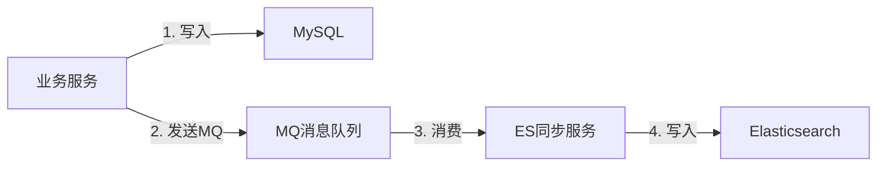

# 数据存储策略规范

## 存储分离原则

### 1. MySQL 和 ES 职责划分

| 存储系统      | 职责     | 特点         | 使用场景             |
|-----------|--------|------------|------------------|
| **MySQL** | 原始数据存储 | 事务性、一致性强   | 写操作、强一致性读、关键业务数据 |
| **ES**    | 聚合数据存储 | 高性能查询、全文检索 | 搜索、统计、聚合查询、弱一致性读 |

### 2. 数据同步策略

**原则**: 通过 MQ 异步同步数据到 ES，保证数据最终一致性。



**实现流程**：

1. 业务数据写入 MySQL（保证事务性）
2. 同步发送 MQ 消息（包含变更数据）
3. ES 同步服务消费 MQ 消息
4. 异步写入 ES 索引

### 3. 草稿数据和正式数据分离

草稿数据和正式数据要分离存储，避免数据污染。

**方案 A: 使用状态字段区分**（推荐简单场景）

```java
public class TaskEntity {
    private Long id;
    private String taskCode;
    private Integer status;  // 1-草稿，2-正式
    // ...
}

// 查询时过滤
QueryCondition condition = new QueryCondition();
condition.setStatus(TaskStatusEnum.PUBLISHED.value());  // 只查正式数据
```

**方案 B: 使用独立表存储**（推荐复杂场景）

```sql
-- 草稿表
CREATE TABLE growth_task_draft (
    id bigint NOT NULL AUTO_INCREMENT,
    task_code varchar(64) NOT NULL,
    task_name varchar(255) NOT NULL,
    status int NOT NULL DEFAULT 1,  -- 草稿状态
    -- ... 其他字段
);

-- 正式表
CREATE TABLE growth_task (
    id bigint NOT NULL AUTO_INCREMENT,
    task_code varchar(64) NOT NULL,
    task_name varchar(255) NOT NULL,
    status int NOT NULL DEFAULT 2,  -- 正式状态
    -- ... 其他字段
);
```

**分离的好处**：

- ✅ 草稿数据不影响正式数据查询性能
- ✅ 草稿数据可以独立清理
- ✅ 表结构可以独立优化
- ✅ 避免误操作影响正式数据

## Region 数据隔离

### 1. Region 字段要求 (NON-NEGOTIABLE)

**所有核心业务表必须包含 `region` 字段**

```sql
CREATE TABLE growth_task (
    id bigint NOT NULL AUTO_INCREMENT,
    task_code varchar(64) NOT NULL,
    region varchar(32) NOT NULL,  -- 必须包含
    -- ... 其他字段
    UNIQUE KEY uk_code_region (task_code, region)  -- 唯一约束包含region
);
```

### 2. 查询方法必须包含 region 参数

**DAO 层**：

```java
public interface TaskDAO {
    /**
     * 根据编码和地区查询
     */
    TaskEntity selectByCodeAndRegion(
        @Param("taskCode") String taskCode, 
        @Param("region") String region
    );
    
    /**
     * 分页查询（QueryCondition中必须包含region）
     */
    List<TaskEntity> selectByCondition(QueryCondition condition);
    
    @Data
    class QueryCondition {
        private String taskCode;
        private String region;  // 必须包含
        private Integer status;
    }
}
```

**Repository 层**：

```java
public interface TaskRepository {
    /**
     * 根据编码和地区查询
     */
    TaskDO getByCodeAndRegion(String taskCode, String region);
    
    /**
     * 分页查询（QueryDO中必须包含region）
     */
    List<TaskDO> listByQuery(TaskQueryDO queryDO);
}

@Data
public class TaskQueryDO {
    private String taskCode;
    private String region;  // 必须包含
    private Integer status;
}
```

### 3. 索引设计考虑 Region

所有包含 `region` 字段的查询都必须使用包含 `region` 的索引。

```sql
-- 复合索引包含region
CREATE INDEX idx_region_status ON growth_task (region, status);
CREATE INDEX idx_region_code ON growth_task (region, task_code);

-- 唯一约束包含region
CREATE UNIQUE INDEX uk_code_region ON growth_task (task_code, region);
```

## 分库分表策略

### 1. 水平分表

对于数据量大的表（如商家任务记录表），按 `region` 进行水平分表。

```sql
-- 中国区表
CREATE TABLE merchant_task_record_cn (
    id bigint NOT NULL AUTO_INCREMENT,
    merchant_id bigint NOT NULL,
    task_id bigint NOT NULL,
    region varchar(32) NOT NULL DEFAULT 'CN',
    -- ... 其他字段
);

-- 新加坡区表
CREATE TABLE merchant_task_record_sg (
    id bigint NOT NULL AUTO_INCREMENT,
    merchant_id bigint NOT NULL,
    task_id bigint NOT NULL,
    region varchar(32) NOT NULL DEFAULT 'SG',
    -- ... 其他字段
);
```

**路由策略**：

```java
@Repository
public class MerchantRecordDAOImpl implements MerchantRecordDAO {
    
    @Autowired
    private MerchantRecordCnMapper cnMapper;
    
    @Autowired
    private MerchantRecordSgMapper sgMapper;
    
    @Override
    public int insert(MerchantRecordEntity entity) {
        // 根据region路由到不同的表
        if ("CN".equals(entity.getRegion())) {
            return cnMapper.insertSelective(entity);
        } else if ("SG".equals(entity.getRegion())) {
            return sgMapper.insertSelective(entity);
        } else {
            throw new RuntimeException("不支持的地区: " + entity.getRegion());
        }
    }
}
```

### 2. 分库策略（可选）

对于多机房部署，可以按 region 分库：

```yaml
# application.yml
datasource:
  cn:
    url: jdbc:mysql://cn-db:3306/merchant_growth
    username: xxx
    password: xxx
  sg:
    url: jdbc:mysql://sg-db:3306/merchant_growth
    username: xxx
    password: xxx
```

## 缓存策略

### 1. Redis 缓存使用场景

| 数据类型     | 缓存策略       | TTL  | 示例        |
|----------|------------|------|-----------|
| **配置数据** | 主动更新 + TTL | 1小时  | 任务配置、规则配置 |
| **热点数据** | 被动加载 + TTL | 30分钟 | 商家等级、商家信息 |
| **临时数据** | 主动写入       | 根据业务 | 计算中间结果    |

### 2. 缓存Key设计

```java
public class CacheKeyBuilder {
    
    private static final String PREFIX = "merchant_growth";
    
    /**
     * 任务配置缓存Key
     * 格式: merchant_growth:task:config:{region}:{taskCode}
     */
    public static String taskConfigKey(String region, String taskCode) {
        return String.format("%s:task:config:%s:%s", PREFIX, region, taskCode);
    }
    
    /**
     * 商家等级缓存Key
     * 格式: merchant_growth:merchant:level:{region}:{merchantId}
     */
    public static String merchantLevelKey(String region, Long merchantId) {
        return String.format("%s:merchant:level:%s:%d", PREFIX, region, merchantId);
    }
    
    /**
     * 规则缓存Key（包含版本号）
     * 格式: merchant_growth:rule:{region}:{taskId}:{versionId}
     */
    public static String ruleKey(String region, Long taskId, String versionId) {
        return String.format("%s:rule:%s:%d:%s", PREFIX, region, taskId, versionId);
    }
}
```

### 3. 缓存更新策略

**配置数据缓存**（主动更新）：

```java
@Service
public class TaskDomainServiceImpl implements TaskDomainService {
    
    @Autowired
    private TaskRepository taskRepository;
    
    @Autowired
    private RedisTemplate<String, String> redisTemplate;
    
    @Override
    public TaskDO updateTask(TaskDO taskDO) {
        // 1. 更新数据库
        TaskDO updatedTaskDO = taskRepository.update(taskDO);
        
        // 2. 更新缓存
        String cacheKey = CacheKeyBuilder.taskConfigKey(
                taskDO.getRegion(), taskDO.getTaskCode());
        redisTemplate.opsForValue().set(
                cacheKey, 
                objectMapper.writeValueAsString(updatedTaskDO), 
                1, TimeUnit.HOURS
        );
        
        return updatedTaskDO;
    }
    
    @Override
    public TaskDO getTaskByCode(String taskCode, String region) {
        // 1. 尝试从缓存获取
        String cacheKey = CacheKeyBuilder.taskConfigKey(region, taskCode);
        String cachedValue = redisTemplate.opsForValue().get(cacheKey);
        
        if (cachedValue != null) {
            return objectMapper.readValue(cachedValue, TaskDO.class);
        }
        
        // 2. 缓存未命中，查询数据库
        TaskDO taskDO = taskRepository.getByCodeAndRegion(taskCode, region);
        
        // 3. 写入缓存
        if (taskDO != null) {
            redisTemplate.opsForValue().set(
                    cacheKey, 
                    objectMapper.writeValueAsString(taskDO), 
                    1, TimeUnit.HOURS
            );
        }
        
        return taskDO;
    }
}
```

### 4. 缓存失效策略

```java
@Service
public class TaskDomainServiceImpl implements TaskDomainService {
    
    /**
     * 删除任务（同时清除缓存）
     */
    @Override
    public void deleteTask(String taskCode, String region) {
        // 1. 删除数据库记录
        taskRepository.deleteByCodeAndRegion(taskCode, region);
        
        // 2. 清除缓存
        String cacheKey = CacheKeyBuilder.taskConfigKey(region, taskCode);
        redisTemplate.delete(cacheKey);
    }
    
    /**
     * 批量清除缓存
     */
    public void clearTaskCache(String region) {
        String pattern = String.format("merchant_growth:task:config:%s:*", region);
        Set<String> keys = redisTemplate.keys(pattern);
        if (CollectionUtils.isNotEmpty(keys)) {
            redisTemplate.delete(keys);
        }
    }
}
```

## 事务管理策略

### 1. 事务边界

**事务应该在 Repository 实现层或更底层管理**

```java
// ✅ 正确：在Repository实现层添加事务
@Repository
public class TaskRepositoryImpl implements TaskRepository {
    
    @Autowired
    private TaskDAO taskDAO;
    
    @Autowired
    private RuleDAO ruleDAO;
    
    @Override
    @Transactional
    public TaskDO saveTaskWithRules(TaskDO taskDO, List<RuleDO> ruleList) {
        // 1. 保存任务
        TaskEntity taskEntity = taskDO.toEntity();
        taskDAO.insert(taskEntity);
        taskDO.setId(taskEntity.getId());
        
        // 2. 保存规则（同一事务）
        for (RuleDO ruleDO : ruleList) {
            ruleDO.setTaskId(taskDO.getId());
            RuleEntity ruleEntity = ruleDO.toEntity();
            ruleDAO.insert(ruleEntity);
        }
        
        return taskDO;
    }
}

// ❌ 错误：在DomainService添加事务（违反规范）
@Service
public class TaskDomainServiceImpl implements TaskDomainService {
    
    @Transactional  // 错误！领域层不应直接管理事务
    public TaskDO createTask(TaskDO taskDO) {
        // ...
    }
}
```

### 2. 分布式事务

对于跨系统的操作，使用 MQ 保证最终一致性，避免分布式事务。

```java
@Service
public class MonthlySettleAppServiceImpl implements MonthlySettleAppService {
    
    @Autowired
    private MerchantRecordRepository merchantRecordRepository;
    
    @Autowired
    private BenefitMQProducer benefitMQProducer;
    
    @Override
    public void executeMonthlySettle(MonthlySettleBO settleBO) {
        // 1. 本地事务：更新商家记录
        List<MerchantRecordDO> recordList = merchantRecordRepository
                .batchSettle(settleBO.getTaskId(), settleBO.getCycleStr());
        
        // 2. 发送MQ消息：触发权益发放（异步，最终一致性）
        for (MerchantRecordDO recordDO : recordList) {
            BenefitGrantMessage message = buildBenefitMessage(recordDO);
            benefitMQProducer.send(message);
        }
    }
}
```

## 数据一致性保证

### 1. 幂等性设计

所有写操作都应支持幂等：

```java
@Repository
public class MerchantRecordDAOImpl implements MerchantRecordDAO {
    
    @Override
    public int insertOrUpdate(MerchantRecordEntity entity) {
        // 使用 INSERT ... ON DUPLICATE KEY UPDATE 保证幂等
        return mapper.insertOrUpdate(entity);
    }
}
```

```xml
<!-- MyBatis Mapper -->
<insert id="insertOrUpdate">
    INSERT INTO merchant_task_record (
        merchant_id, task_id, cycle_str, predicted_stage, region
    ) VALUES (
        #{merchantId}, #{taskId}, #{cycleStr}, #{predictedStage}, #{region}
    ) ON DUPLICATE KEY UPDATE
        predicted_stage = VALUES(predicted_stage),
        utime = #{utime}
</insert>
```

### 2. 乐观锁

对于并发更新场景，使用乐观锁：

```java
public class TaskEntity {
    private Long id;
    private String taskCode;
    private Integer version;  // 版本号
}
```

```xml
<update id="updateByVersion">
    UPDATE growth_task
    SET task_name = #{taskName},
        version = version + 1,
        utime = #{utime}
    WHERE id = #{id}
      AND version = #{version}
</update>
```

```java
@Override
public int updateByVersion(TaskEntity entity) {
    int rows = taskMapper.updateByVersion(entity);
    if (rows == 0) {
        throw new RuntimeException("数据已被其他用户修改，请刷新后重试");
    }
    return rows;
}
```

## 相关文档

- [基础设施层标准](@specrules/00_general/architecture/infra_layer_standards.md)
- [领域层标准](@specrules/00_general/architecture/domain_layer_standards.md)
- [分层架构核心原则](@specrules/00_general/architecture/layered_architecture_core.md)

---

## 版本与变更

- 1.0.0 (2025-02-06): 初始化版本与变更记录
