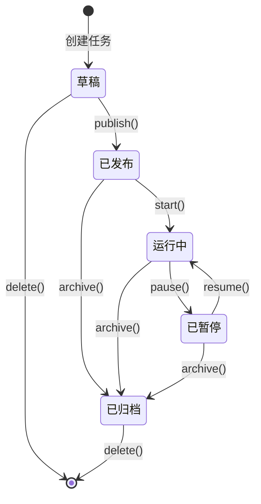
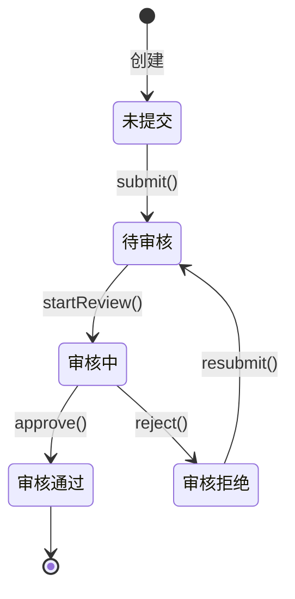

# 状态机设计规范

## 设计原则

### 1. 何时需要状态机

复杂业务状态必须设计状态机，明确状态流转规则。

**需要状态机的场景**：

- ✅ 业务对象有明确的生命周期（如：草稿 → 待审核 → 已发布 → 已归档）
- ✅ 状态之间的转换有明确的规则和限制
- ✅ 不同状态下允许的操作不同
- ✅ 状态转换需要权限控制

**不需要状态机的场景**：

- ❌ 简单的开关状态（如：启用/禁用）
- ❌ 状态之间可以任意转换
- ❌ 状态转换没有业务规则约束

### 2. 状态枚举设计原则

#### 预留扩展空间

状态枚举要考虑业务扩展性，预留足够的状态值。

**✅ 良好的设计**：

```java
public enum TaskStatusEnum {
    DRAFT(1, "草稿"),
    PUBLISHED(2, "已发布"),
    RUNNING(3, "运行中"),
    PAUSED(4, "已暂停"),
    ARCHIVED(5, "已归档");
    // 预留 6-10 用于未来扩展
    
    private final Integer value;
    private final String desc;
    
    TaskStatusEnum(Integer value, String desc) {
        this.value = value;
        this.desc = desc;
    }
    
    public Integer value() {
        return value;
    }
    
    public String desc() {
        return desc;
    }
    
    public static TaskStatusEnum getByValue(Integer value) {
        for (TaskStatusEnum status : values()) {
            if (status.value.equals(value)) {
                return status;
            }
        }
        throw new IllegalArgumentException("Invalid TaskStatus value: " + value);
    }
}
```

#### 状态值分段管理

对于复杂业务，可以按段划分状态值：

```java
public enum TaskStatusEnum {
    // 编辑态：1-10
    DRAFT(1, "草稿"),
    EDITING(2, "编辑中"),
    
    // 审核态：11-20
    PENDING_REVIEW(11, "待审核"),
    REVIEWING(12, "审核中"),
    REVIEW_REJECTED(13, "审核拒绝"),
    
    // 运行态：21-30
    PUBLISHED(21, "已发布"),
    RUNNING(22, "运行中"),
    PAUSED(23, "已暂停"),
    
    // 归档态：31-40
    ARCHIVED(31, "已归档"),
    DELETED(32, "已删除");
    
    // ...
}
```

### 3. 审核状态和业务状态分离

审核状态和业务状态要分离设计，避免耦合。

**✅ 正确设计**：

```java
// 业务状态
public enum TaskStatusEnum {
    DRAFT(1, "草稿"),
    PUBLISHED(2, "已发布"),
    RUNNING(3, "运行中"),
    ARCHIVED(4, "已归档");
}

// 审核状态（独立管理）
public enum AuditStatusEnum {
    NOT_SUBMITTED(1, "未提交"),
    PENDING(2, "待审核"),
    APPROVED(3, "审核通过"),
    REJECTED(4, "审核拒绝");
}

// 领域对象
public class TaskDO {
    private Integer status;      // 业务状态
    private Integer auditStatus; // 审核状态（可选，用于需要审核的场景）
}
```

**❌ 错误设计**：

```java
// 状态混杂，难以扩展和维护
public enum TaskStatusEnum {
    DRAFT(1, "草稿"),
    PENDING_AUDIT(2, "待审核"),     // 审核状态混入
    AUDIT_REJECTED(3, "审核拒绝"),  // 审核状态混入
    PUBLISHED(4, "已发布"),
    RUNNING(5, "运行中");
}
```

### 4. 状态流转规则明确

状态流转要有明确的触发条件和权限控制。

## 实现规范

### 1. 状态机逻辑收敛在 Domain 层

状态机的核心逻辑必须在领域层实现，不能分散在多个层。

**位置**: `domain/model/` (领域对象中)

### 2. 状态流转方法放在领域对象中

```java
@Data
public class TaskDO {
    private Long id;
    private String taskCode;
    private Integer status;
    
    /**
     * 状态流转：发布任务
     * 
     * 前置条件：必须是草稿状态
     * 后置状态：已发布
     */
    public void publish() {
        // 1. 状态校验
        if (TaskStatusEnum.PUBLISHED.value().equals(this.status)) {
            throw new RuntimeException("任务已发布，不能重复发布");
        }
        
        if (!TaskStatusEnum.DRAFT.value().equals(this.status)) {
            throw new RuntimeException(
                String.format("只有草稿状态的任务才能发布，当前状态：%s", 
                    TaskStatusEnum.getByValue(this.status).desc())
            );
        }
        
        // 2. 状态流转
        this.status = TaskStatusEnum.PUBLISHED.value();
    }
    
    /**
     * 状态流转：启动任务
     * 
     * 前置条件：必须是已发布状态
     * 后置状态：运行中
     */
    public void start() {
        if (TaskStatusEnum.RUNNING.value().equals(this.status)) {
            throw new RuntimeException("任务已在运行中");
        }
        
        if (!TaskStatusEnum.PUBLISHED.value().equals(this.status)) {
            throw new RuntimeException("只有已发布的任务才能启动");
        }
        
        this.status = TaskStatusEnum.RUNNING.value();
    }
    
    /**
     * 状态流转：暂停任务
     * 
     * 前置条件：必须是运行中状态
     * 后置状态：已暂停
     */
    public void pause() {
        if (TaskStatusEnum.PAUSED.value().equals(this.status)) {
            throw new RuntimeException("任务已暂停");
        }
        
        if (!TaskStatusEnum.RUNNING.value().equals(this.status)) {
            throw new RuntimeException("只有运行中的任务才能暂停");
        }
        
        this.status = TaskStatusEnum.PAUSED.value();
    }
    
    /**
     * 状态流转：归档任务
     * 
     * 前置条件：不能是草稿状态
     * 后置状态：已归档
     */
    public void archive() {
        if (TaskStatusEnum.ARCHIVED.value().equals(this.status)) {
            throw new RuntimeException("任务已归档");
        }
        
        if (TaskStatusEnum.DRAFT.value().equals(this.status)) {
            throw new RuntimeException("草稿状态的任务不能归档，请直接删除");
        }
        
        this.status = TaskStatusEnum.ARCHIVED.value();
    }
    
    /**
     * 状态查询：是否可以编辑
     */
    public boolean canEdit() {
        return TaskStatusEnum.DRAFT.value().equals(this.status);
    }
    
    /**
     * 状态查询：是否可以删除
     */
    public boolean canDelete() {
        return TaskStatusEnum.DRAFT.value().equals(this.status) 
            || TaskStatusEnum.ARCHIVED.value().equals(this.status);
    }
    
    /**
     * 状态查询：是否有效
     */
    public boolean isValid() {
        return !TaskStatusEnum.ARCHIVED.value().equals(this.status);
    }
}
```

### 3. 应用层负责调用状态机

应用层协调状态机的调用和结果处理，但不包含状态流转逻辑。

```java
@Service
@Slf4j
public class TaskAppServiceImpl implements TaskAppService {
    
    @Autowired
    private TaskDomainService taskDomainService;
    
    @Override
    public TaskBO publishTask(String taskCode, String region) {
        log.info("发布任务, taskCode: {}, region: {}", taskCode, region);
        
        // 1. 调用领域服务（领域服务内部会调用DO的状态流转方法）
        TaskDO taskDO = taskDomainService.publishTask(taskCode, region);
        
        // 2. DO → BO 转换
        TaskBO taskBO = boConverter.doToBO(taskDO);
        
        log.info("任务发布成功, taskId: {}", taskBO.getId());
        return taskBO;
    }
}
```

### 4. 领域服务封装状态流转逻辑

```java
@Service
@Slf4j
public class TaskDomainServiceImpl implements TaskDomainService {
    
    @Autowired
    private TaskRepository taskRepository;
    
    @Autowired
    private RuleRepository ruleRepository;
    
    @Override
    public TaskDO publishTask(String taskCode, String region) {
        log.info("发布任务, taskCode: {}, region: {}", taskCode, region);
        
        // 1. 查询任务
        TaskDO taskDO = taskRepository.getByCodeAndRegion(taskCode, region);
        if (taskDO == null) {
            throw new RuntimeException("任务不存在");
        }
        
        // 2. 业务规则校验
        if (!validateTaskRules(taskDO)) {
            throw new RuntimeException("任务规则不完整，不能发布");
        }
        
        // 3. 状态流转（调用DO的行为方法）
        taskDO.publish();
        
        // 4. 持久化
        TaskDO updatedTaskDO = taskRepository.update(taskDO);
        
        log.info("任务发布成功, taskId: {}", updatedTaskDO.getId());
        return updatedTaskDO;
    }
    
    private boolean validateTaskRules(TaskDO taskDO) {
        List<RuleDO> ruleList = ruleRepository.getByTaskId(taskDO.getId());
        return CollectionUtils.isNotEmpty(ruleList);
    }
}
```

## 状态流转图示例

### 任务状态流转



### 审核流程状态流转



## 权限控制

### 状态流转的权限检查

状态流转可以结合权限控制：

```java
public class TaskDO {
    /**
     * 发布任务（需要权限检查）
     * 
     * @param operator 操作人
     */
    public void publish(String operator) {
        // 1. 权限校验（可选，也可在DomainService中做）
        if (!hasPublishPermission(operator)) {
            throw new RuntimeException("无权限发布任务");
        }
        
        // 2. 状态校验
        if (!TaskStatusEnum.DRAFT.value().equals(this.status)) {
            throw new RuntimeException("只有草稿状态的任务才能发布");
        }
        
        // 3. 状态流转
        this.status = TaskStatusEnum.PUBLISHED.value();
    }
    
    private boolean hasPublishPermission(String operator) {
        // 权限校验逻辑
        return true;
    }
}
```

## 最佳实践

### 1. 状态流转日志

在状态流转时记录完整的日志：

```java
public void publish() {
    Integer oldStatus = this.status;
    
    // 状态校验和流转
    if (!TaskStatusEnum.DRAFT.value().equals(this.status)) {
        throw new RuntimeException("状态流转失败：当前状态不允许发布");
    }
    
    this.status = TaskStatusEnum.PUBLISHED.value();
    
    // 记录状态变更（在DomainService中）
    log.info("任务状态流转, taskId: {}, oldStatus: {}, newStatus: {}", 
            this.id, 
            TaskStatusEnum.getByValue(oldStatus).desc(),
            TaskStatusEnum.getByValue(this.status).desc());
}
```

### 2. 状态流转历史记录

对于重要的状态流转，建议记录历史：

```java
// 状态变更历史表
public class TaskStatusHistoryEntity {
    private Long id;
    private Long taskId;
    private Integer oldStatus;
    private Integer newStatus;
    private String operator;
    private String reason;
    private Long ctime;
}

// 在DomainService中记录
@Override
public TaskDO publishTask(String taskCode, String region, String operator) {
    TaskDO taskDO = taskRepository.getByCodeAndRegion(taskCode, region);
    
    Integer oldStatus = taskDO.getStatus();
    
    // 状态流转
    taskDO.publish();
    
    // 持久化
    TaskDO updatedTaskDO = taskRepository.update(taskDO);
    
    // 记录状态变更历史
    taskStatusHistoryRepository.save(
        taskDO.getId(), oldStatus, taskDO.getStatus(), operator, "发布任务"
    );
    
    return updatedTaskDO;
}
```

### 3. 状态机测试

为状态流转编写完整的单元测试：

```java
@Test
public void testPublishTask() {
    // 1. 准备数据
    TaskDO taskDO = new TaskDO();
    taskDO.setStatus(TaskStatusEnum.DRAFT.value());
    
    // 2. 执行状态流转
    taskDO.publish();
    
    // 3. 验证结果
    assertEquals(TaskStatusEnum.PUBLISHED.value(), taskDO.getStatus());
}

@Test
public void testPublishTask_WhenNotDraft_ShouldThrowException() {
    // 1. 准备数据
    TaskDO taskDO = new TaskDO();
    taskDO.setStatus(TaskStatusEnum.RUNNING.value());
    
    // 2. 执行并验证异常
    assertThrows(RuntimeException.class, () -> {
        taskDO.publish();
    });
}
```

## 相关文档

- [领域层标准](@specrules/00_general/architecture/domain_layer_standards.md)
- [应用层标准](@specrules/00_general/architecture/app_layer_standards.md)
- [数据对象命名规范](@specrules/00_general/naming/data_object_naming.md)

---

## 版本与变更

- 1.0.0 (2025-02-06): 初始化版本与变更记录
